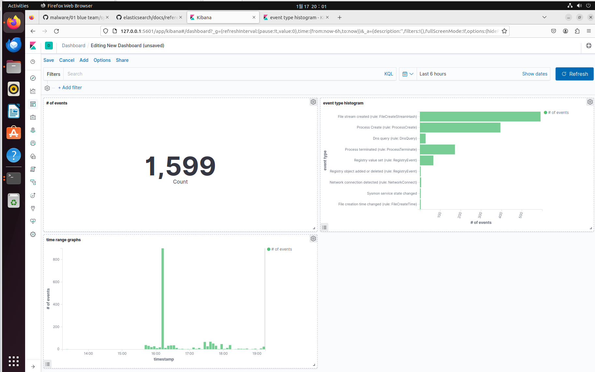
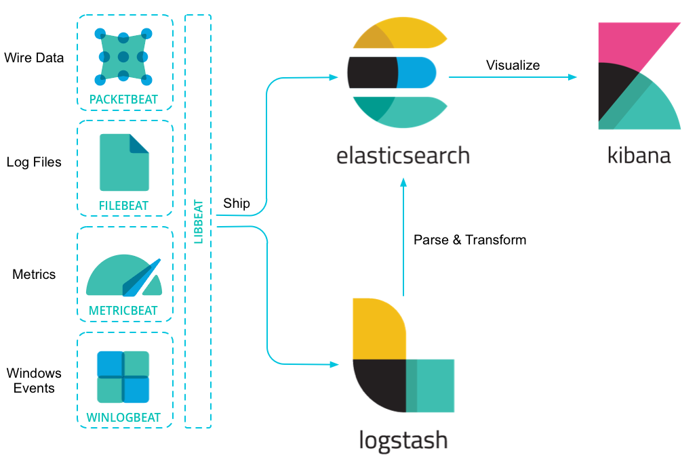
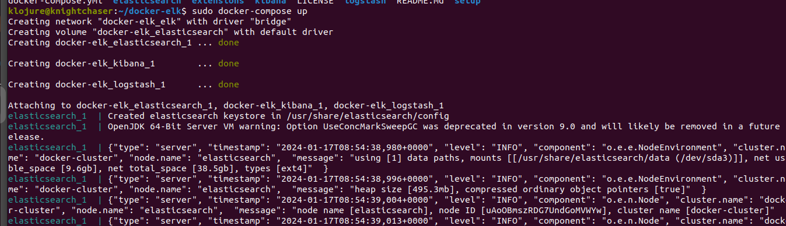
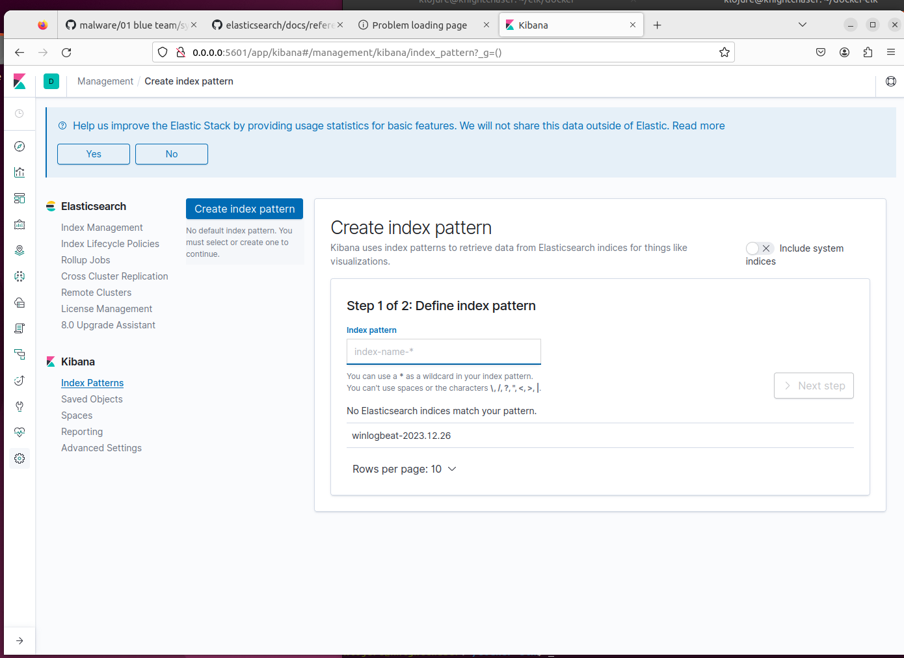
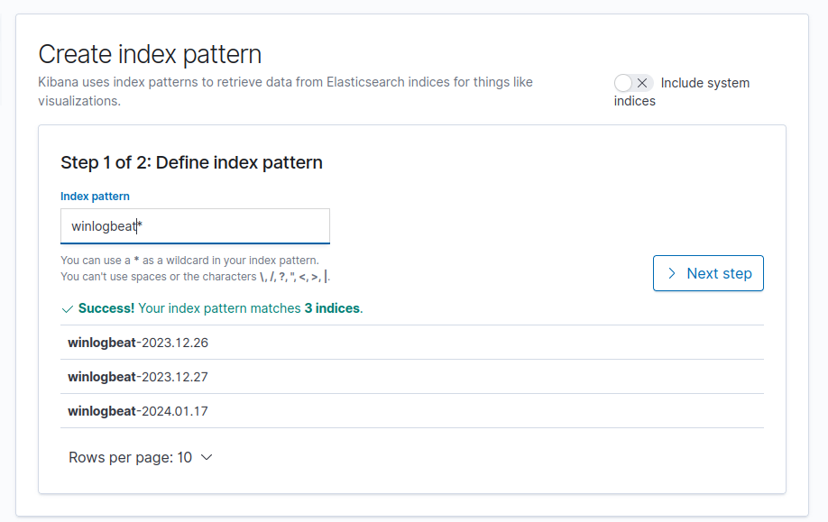
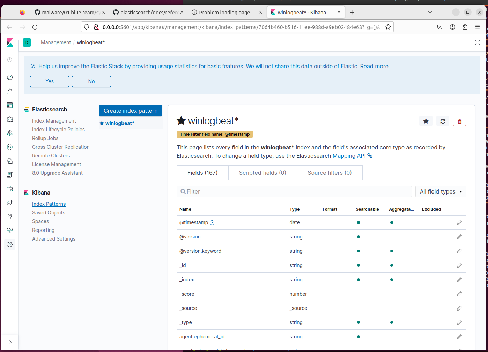
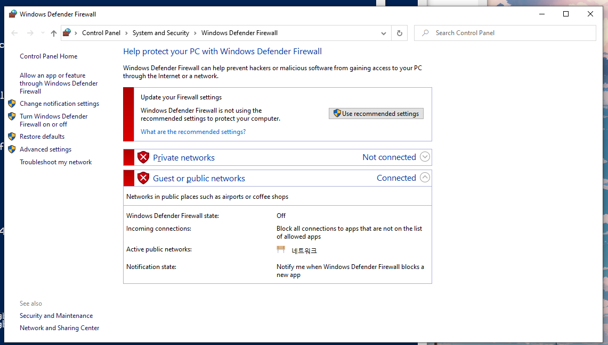

# docker-elk-winlogbeat


### **Integrated Windows endpoint log management** (Docker + ELK(ElasticSearch, Logstash, Kibana) + Winlogbeat based)

> **Preview**<br>

**Tested environments**

-   ELK Server(Management server); Ubuntu 22.04.6 LTS, 64bits
-   ELK Client(Windows endpoint); Windows 10 Home, 64bits
-   ELK stack version `7.1.1`(Elasticsearch, Logstash, Kibana + winlogbeats)
-   Both server and client are interconnected in the VMWare virtualization environment, a network configured as NAT(Network Address Translation) mode.

### **Overall mechanism**



-   Via **winlogbeat**, relay gathers activity information from **sysmon** on the WIndows endpoint to **logstash** on ELK server.
-   **logstash** reads, parses, transforms, and relays the data to **elasticsearch**.
-   **kibana** searches and visualizes the information from **elasticsearch**.

### Setup

-   **ELK server** (suppose the IP address is `192.168.133.141/24`)

    -   Create or navigate the empty dedicated directory.
    -   Install `git`, `docker`, and `docker-compose`.
    -   Get the environment `git clone https://github.com/KnightChaser/docker-elk-winlogbeat.git` at once.
    -   Check the configuration files. (Below is an explanation. You don't need to change this if you just want to use as default.)

        -   `docker-compose.yml` is for overall docker configuration setup. To make it simple, this project uses `7.1.1` version instead of `8`, not to consider about the enrollment token and miscellaneous security settings. Also, **port** configuration will be standardized according to this yml file. Other applications or setting files shouldn't have any conflict with this file.

        ```yml
        # We will use ELK stack families with version of 7.1.1 (even including winlogbeat)
            elasticsearch:
                image: docker.elastic.co/elasticsearch/elasticsearch:7.1.1
                    ports:
                    - 9200:9200
                    - 9300:9300
                # ...
            logstash:
                image: docker.elastic.co/logstash/logstash:7.1.1
                    ports:
                    - 5044:5044
                    - 5000:5000/tcp   # <--- logstash will communicate with winlogbeat installed on Windows endpoint via this port (:5000 in this case.)
                    - 5000:5000/udp
                    - 9600:9600
                # ...
            kibana:
                image: docker.elastic.co/kibana/kibana:7.1.1
                    ports:
                    - 5601:5601
                # ...
        ```

        -   `elasticsearch/config/elasticsearch.yml` is for Elasticsearch configuration. To make this service is accessible by everyone, I set `network.host` property as `0.0.0.0`.

        ```yml
        cluster.name: "docker-cluster"
        network.host: 0.0.0.0
        discovery.type: single-node
        ```

        -   `kibana/config/kibana.yml` is for Kibana configuration. Because Kibana receives and interacts with Elasticsearch, Port number setting should be identical with `docker-compose.yml`.

        ```yml
        server.name: kibana
        server.host: 0.0.0.0
        elasticsearch.hosts: ["http://elasticsearch:9200"]
        xpack.monitoring.ui.container.elasticsearch.enabled: true
        ```

        -   `logstash/config/logstash.yml` is for Logstash configuration connected to elasticsearch(forwarding parsed and transformed data.). Port number setting should be identical with `docker-composes.yml`.

        ```yml
        http.host: "0.0.0.0"
        xpack.monitoring.elasticsearch.hosts: ["http://elasticsearch:9200"]
        ```

        -   `logstash/pipeline/logstash.conf` is for the Logstash pipelining configuration connected to any pre-configured Windows endpoint(from winlogbeat). `port` setting in `input` should correspond to both `docker-compose.yml` and winlogbeat YML setting file in Windows endpoint. `hosts` in `output` section describes Elasticsearch connection information. This information should be identical to `docker-compose.yml`. Other configurations may be adjusted for your needs(For parsing, indexing, transforming data during the pipelining procedure.).

        ```
        input {
            beats{
                port => 5000
            }
        }

        output {
            elasticsearch {
                hosts => "elasticsearch:9200"
                user => "username"
                password => "password"
                index => "%{[@metadata][beat]}-%{+YYYY.MM.dd}"
                document_type => "%{[@metadata][type]}"
            }
        }
        ```

    -   Initiate the ELK server by hitting `sudo docker-compose up -d`. To terminate the server operation, hit `sudo docker-compose down -v` instead.
        

    -   Complete ELK Client setup
    -   Open a web browser in the ELK server and access **`localhost:5601`**. Head to `Kibana > Index patterns` and set up the GUI management panel. Define the index pattern, and find the fields. You can customize the setting, add more things to the pipeline, or build a new fancy GUI panel. Creative parts are on your hands!
        -   
        -   
        -   

<br>
<br>

-   **ELK Client** (suppose the IP address is `192.168.133.142/24`)

    -   Install the **sysmon**(system monitor) program from the official Microsoft webpage. (Modern versions are okay.)

    ```
    https://learn.microsoft.com/en-us/sysinternals/downloads/sysmon
    ```

    -   Download the **winlogbeat** with version of `7.1.1`. (Because ELK stack is configured as the version of `7.1.1`, matching the overall version is highly encouraged.)

    ```
    https://www.elastic.co/downloads/past-releases/winlogbeat-7-1-1
    ```

    -   Test an ICMP connectivity(`ping`) between ELK servers and ELK clients. You can consider disabling the Windows firewall that blocks communications while the machines are part of the ELK stack.
        

    -   Initiate sysmon. If you don't have any XML sysmon rule, you can download and use `sysmonconfig-export.yml` file as the default for sysmon. And, execute the sysmon service. (`.\sysmon.exe --accepteula`, `.\sysmon.exe -i <path_to>\sysmonconfig-export.xml`...)

    ```
    https://github.com/SwiftOnSecurity/sysmon-config/blob/master/sysmonconfig-export.xml
    ```

    -   Save the **winlogbeat** configuration with below content(**IP address/Port number should be matches with ELK server.**) file as `winlogbeat.yml` at the right directory of **winlogbeat**.

    ```yml
    winlogbeat.event_logs:
        - name: Microsoft-Windows-Sysmon/Operational

    output.logstash:
        hosts: ["192.168.133.141:5000"]
        index: winlogbeat
    ```

    -   Initiate **winlogbeat**. (You can check **winlogbeat** service registry at `Services`(`Sc.exe`) utility.)

    ```powershell
    .\winlogbeat.exe -c .\winlogbeat.yml
    .\install-service-winlogbeat.ps1
    .\Start-Service winlogbeat
    ```

### Inspired from

-   https://github.com/KnightChaser/KnightChaser
-   https://github.com/choisungwook/malware
-   https://github.com/justmeandopensource/elk
-   https://github.com/deviantony/docker-elk
-   https://github.com/SwiftOnSecurity/sysmon-config/blob/master/sysmonconfig-export.xml
