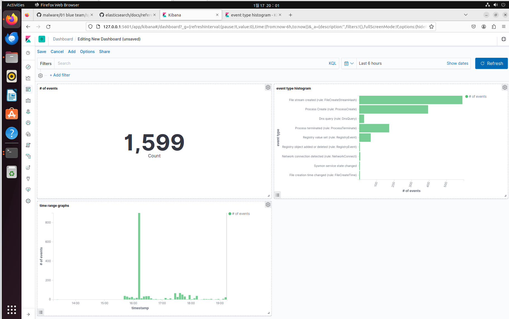

# elk-siem

This project is a simple ELK stack-based SIEM (_Security Information and Event Management_) system for Windows endpoints. It is designed to collect, parse, and visualize Windows endpoint logs in a centralized manner by utilizing Sysmon and Winlogbeat.

## Architecture

The overall architecture is based on the ELK stack, which consists of Elasticsearch, Logstash, and Kibana. It uses **[Beats](https://www.elastic.co/beats)** as a data shipper to collect logs from several endpoints. In this case, **[Winlogbeat](https://www.elastic.co/beats/winlogbeat)** is used to collect Windows event logs.

> _On Linux, you can use **[Filebeat](https://www.elastic.co/beats/filebeat)** or **[Metricbeat](https://www.elastic.co/beats/metricbeat)** to collect logs and metrics from the operating system and services. For MacOS, **[Auditbeat](https://www.elastic.co/beats/auditbeat)** is available to collect audit events._

-   Via **Winlogbeat**, relay gathers activity information from **sysmon** on the Windows endpoint to **Logstash** on ELK server.
-   **Logstash** reads, parses, transforms, and relays the data to **Elasticsearch**.
-   **Kibana** searches and visualizes the information from **Elasticsearch**.

## Getting Started

This project is designed to be used with [Docker](https://www.docker.com/). To get started, clone this repository and follow the instructions in the [install guide](./_guides/INSTALLATION.md).

## License

This project is licensed under the MIT License - see the [LICENSE](LICENSE) file for details.

## Inspired from

-   https://github.com/KnightChaser/KnightChaser
-   https://github.com/deviantony/docker-elk
