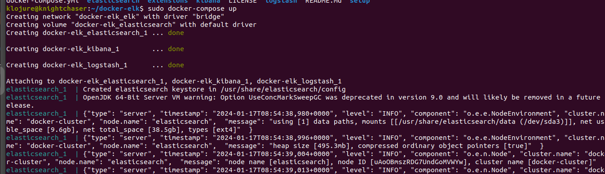
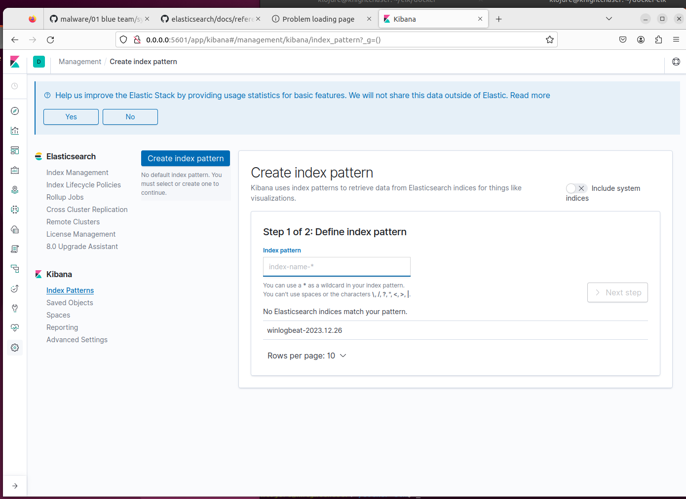
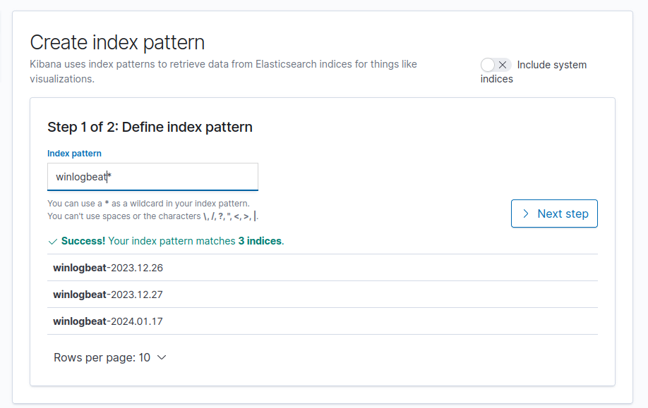
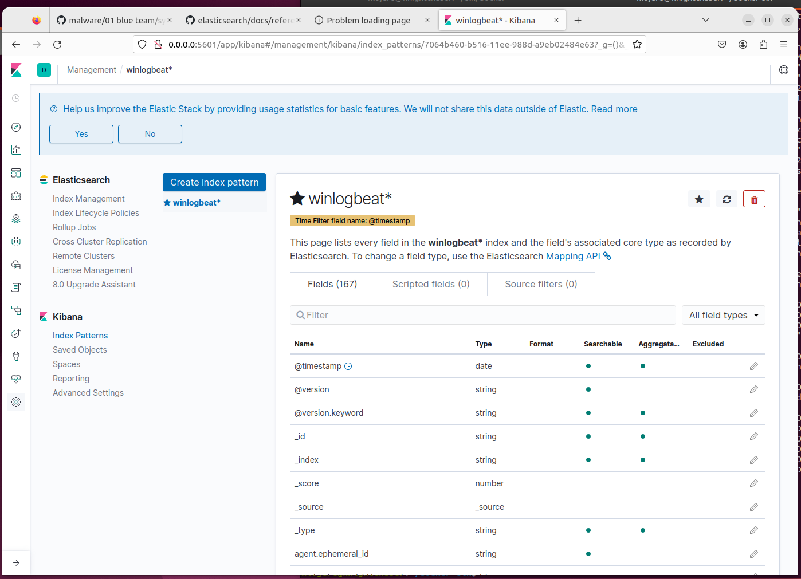
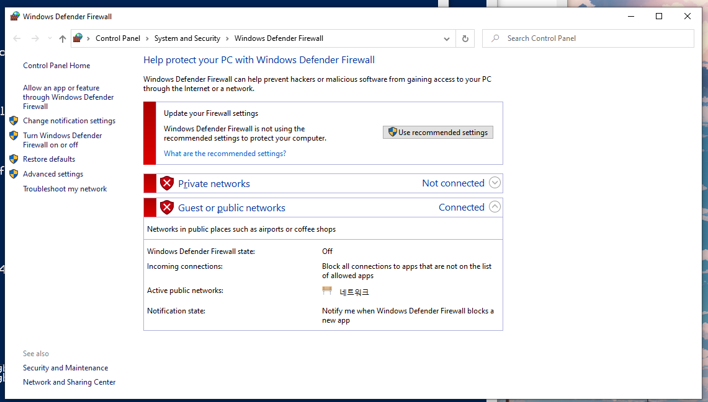

# Installation

This guide will help you set up the ELK stack-based SIEM system for Windows endpoints. We will use Docker to deploy the ELK stack and Winlogbeat with Sysmon to collect, parse, and visualize Windows event logs.

> If you want to use this project with Linux or MacOS, you can use **Filebeat**, **Metricbeat**, or **Auditbeat** instead of Winlogbeat.

**Tested environments**

-   ELK Server(Management server); Ubuntu 22.04.6 LTS, 64bits
-   ELK Client(Windows endpoint); Windows 10 Home, 64bits
-   ELK stack version `7.1.1`(Elasticsearch, Logstash, Kibana + winlogbeats)
-   Both server and client are interconnected in the VMWare virtualization environment, a network configured as NAT(Network Address Translation) mode.

## Prerequisites

You need to have the following software installed on your system:

-   **Docker**: To deploy the ELK stack and Winlogbeat.
-   **Git**: To clone this repository and download the configuration files.

We will use ELK stack version `7.1.1` for this project for compatibility reasons.

## Setup

First, let's get the ELK server up and running. We will use the default settings. However, if you want to learn more about the configuration files, you can check the [configuration guide](./CONFIGURATION.md).

### Server

-   Clone this repository and navigate to the directory:

    ```bash
    https://github.com/dikayx/elk-siem
    cd elk-siem
    ```

-   Start the cluster (_sudo may be required for Docker commands_):

    ```bash
    docker-compose up -d
    ```

    

    To terminate the server operation, run the following command:

    ```bash
    docker-compose down
    ```

    > The `-v` flag will remove the volumes associated with the containers.

-   [Create a client](#client). _Skip this step if you already have a Windows endpoint with Sysmon and Winlogbeat installed._

-   Open a web browser in the ELK server and access **`localhost:5601`**. Head to `Kibana > Index patterns` and set up the GUI management panel. Define the index pattern, and find the fields. You can customize the setting, add more things to the pipeline, or build a new fancy GUI panel.

    

    

    

That's it! You have successfully set up the server 🥳

### Client

-   Download **Sysmon** from the official [Microsoft](https://learn.microsoft.com/en-us/sysinternals/downloads/sysmon) and follow the installation instructions, which are basically running the following command:

    ```powershell
    .\sysmon64.exe --accepteula --i
    ```

    > You can use a custom XML configuration file for Sysmon. You can find a sample configuration file [here](https://github.com/SwiftOnSecurity/sysmon-config/blob/master/sysmonconfig-export.xml).

    Sysmon will improve the logging capabilities of Windows.

    -   _Optionally_, move Sysmon to `C:\Program Files\Sysmon`:

        ```powershell
        mv .\sysmon64.exe 'C:\Program Files\Sysmon\sysmon64.exe'
        ```

-   Setup **Winlogbeat**:

    > We're using version `7.1.1` of Winlogbeat to match the ELK stack version for compatibility reasons.

    -   Download **Winlogbeat** from [here](https://www.elastic.co/downloads/past-releases/winlogbeat-7-1-1)

    -   Extract the contents into `C:\Program Files\Winlogbeat`.

    -   Open a PowerShell terminal as an administrator and navigate to the Winlogbeat directory:

        ```powershell
        cd 'C:\Program Files\Winlogbeat'
        ```

    -   Install the Winlogbeat service:

        ```powershell
        PowerShell.exe -ExecutionPolicy UnRestricted -File .\install-service-winlogbeat.ps1
        ```

    -   Copy the [winlogbeat.yml](./extensions/winlogbeat/config/winlogbeat.yml) file to the Winlogbeat directory.

        ```powershell
        cp .\extensions\winlogbeat\config\winlogbeat.yml .\
        ```

    -   Edit the `winlogbeat.yml` file to match the IP address and port number of the ELK server:

        ```yml
        output.elasticsearch:
        # Array of hosts to connect to.
        hosts: ["<YOUR_HOST>:9200"]
        # ...
        output.logstash:
        # The Logstash hosts
        hosts: ["<YOUR_HOST>:5044"]
        index: winlogbeat
        # ...
        ```

        > **Note**: Currently, it is configured to `localhost`, assuming the ELK server is running on the same machine. If you are running the ELK server on a different machine, replace `localhost` with the IP address of the ELK server.

    -   Start the Winlogbeat service:

        ```powershell
        Start-Service winlogbeat
        ```

    -   Verify that the Winlogbeat service is running:

        ```powershell
        Get-Service winlogbeat
        ```

    -   To stop the Winlogbeat service, run:

        ```powershell
        Stop-Service winlogbeat
        ```

    You can find the detailed guide for Winlogbeat installation and configuration [here](https://www.elastic.co/guide/en/beats/winlogbeat/7.17/winlogbeat-installation-configuration.html).

That's it! You have successfully set up the client 🥳

#### Testing

Test an ICMP connectivity(`ping`) between ELK servers and ELK clients. You can consider disabling the Windows firewall that blocks communications while the machines are part of the ELK stack.



#### Uninstall

To uninstall the services on the server, just delete the containers and volumes associated with the ELK stack. For the client, you need to remove Sysmon and Winlogbeat.

##### Sysmon

To uninstall Sysmon, run the following command in the Sysmon directory:

```powershell
.\sysmon64.exe -u
```

##### Winlogbeat

To uninstall Winlogbeat, open a PowerShell terminal as an administrator and navigate to the Winlogbeat (`C:\Program Files\Winlogbeat`) directory.

1. Stop the Winlogbeat service:

    ```powershell
    Stop-Service winlogbeat
    ```

2. Uninstall the Winlogbeat service

    ```powershell
    PowerShell.exe -ExecutionPolicy UnRestricted -File .\uninstall-service-winlogbeat.ps1
    ```

    Verify that the service is removed:

    ```powershell
    Get-Service winlogbeat
    ```

3. Remove the Winlogbeat directory:

    ```powershell
    Remove-Item -Recurse -Force 'C:\Program Files\Winlogbeat'
    ```

## Scripts

You can find PowerShell scripts for the client setup in the [extensions/winlogbeat](../extensions/winlogbeat) directory.
